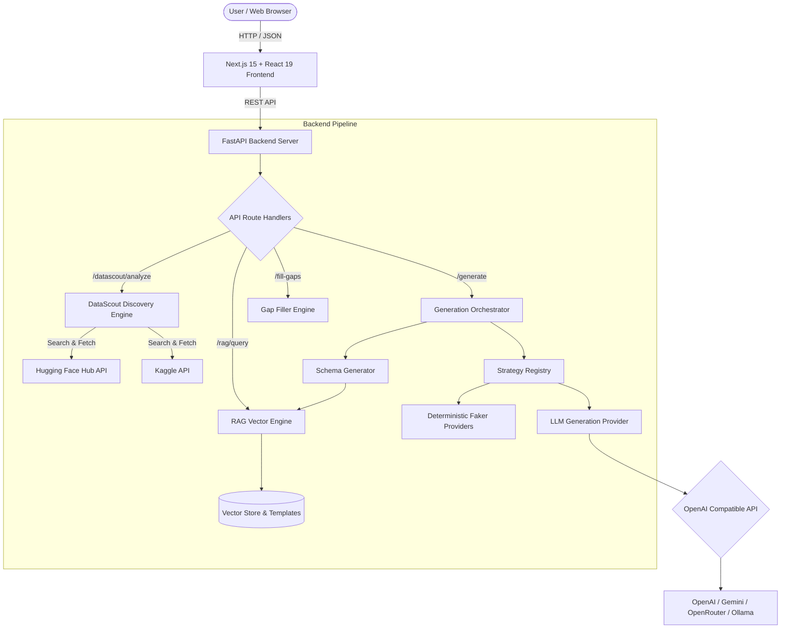

<div align="center">

# 🧪 Synthetic Data Studio

**Enterprise-grade, AI-driven synthetic dataset generation, discovery, and profiling platform.**

[](https://opensource.org/licenses/MIT)
[](https://www.python.org/)
[](https://fastapi.tiangolo.com)
[](https://nextjs.org/)
[](https://react.dev/)
[](https://www.typescriptlang.org/)
[](https://tailwindcss.com/)
[](CONTRIBUTING.md)

<p align="center">
  <a href="#key-features">Key Features</a> •
  <a href="#system-architecture">Architecture</a> •
  <a href="#quickstart">Quickstart</a> •
  <a href="#api-reference">API Reference</a> •
  <a href="#configuration">Configuration</a> •
  <a href="#contributing">Contributing</a>
</p>

</div>

---

## 🌟 Overview

**Synthetic Data Studio** is a full-stack platform that transforms natural language prompts into production-grade, structured datasets. Combining Large Language Models (LLMs), automated dataset discovery (Hugging Face & Kaggle), deterministic synthetic generation strategies, and Retrieval-Augmented Generation (RAG), Synthetic Data Studio delivers realistic, privacy-compliant datasets in seconds.

Whether you need test data for development, benchmarking benchmarks for ML models, or augmented tabular data to address class imbalance, Synthetic Data Studio handles schema inference, multi-modal generation, and instant export in CSV, JSON, and JSONL formats.

---

## ✨ Key Features

- **⚡ Natural Language to Structured Datasets**: Describe your domain and requirements in plain English; the studio infers column schemas, data types, and relational constraints automatically.
- **🔍 Intelligent DataScout Engine**: Before synthesizing from scratch, DataScout searches Hugging Face and Kaggle APIs for verified existing datasets matching your prompt, saving compute and time.
- **🧠 Hybrid Multi-Strategy Generation**:
  - **Deterministic Faker Providers**: High-throughput generation for names, addresses, emails, dates, phones, UUIDs, and numerical distributions.
  - **LLM Semantic Synthesis**: Context-aware realistic text generation for descriptions, comments, reviews, and complex free-form fields.
  - **Gap Filling & Augmentation**: Seamlessly impute missing columns or synthesize new rows matching existing distributions.
- **📚 RAG-Assisted Domain Schemas**: Vector-backed knowledge base with pre-embedded production templates (Finance, Healthcare, E-Commerce, Logistics, SaaS, HR) to ensure realistic relational schemas.
- **📊 Real-Time Studio UI**: Modern dark-themed dashboard featuring interactive tabular previews, row-count scaling, telemetry metrics, and schema inspection.
- **💾 Zero-Lag Client-Side Exporters**: Download generated datasets instantly in CSV, formatted JSON, and JSONL (NDJSON) formats.
- **🔌 Multi-Provider LLM Support**: Native compatibility with OpenAI, Google Gemini, OpenRouter (DeepSeek, Claude, Llama 3), and local self-hosted models via Ollama.

---

## 🏗 System Architecture



---

## 📁 Repository Structure

```
synthetic-data-studio/
├── .github/                      # GitHub Actions workflows & issue templates
│   ├── workflows/ci.yml          # Automated CI (Python tests + Frontend checks)
│   ├── ISSUE_TEMPLATE/           # Bug report & feature request templates
│   └── pull_request_template.md  # PR checklist & template
├── backend/                      # FastAPI Python Application
│   ├── app/
│   │   ├── api/                  # REST route controllers & Pydantic schemas
│   │   │   ├── routes/           # Endpoints: generate, datascout, fill_gaps, rag
│   │   │   └── schemas/          # Request & response data contracts
│   │   ├── core/                 # Config & settings via pydantic-settings
│   │   ├── datascout/            # Hugging Face & Kaggle discovery & profiler
│   │   ├── domain/               # Core data models (Column, Dataset, Constraint)
│   │   ├── generation/           # Orchestrator, planners, & Faker/LLM strategies
│   │   ├── rag/                  # Vector store & template knowledge base
│   │   └── main.py               # FastAPI application entry point
│   ├── tests/                    # Unit tests & verification suite
│   ├── .env.example              # Template backend environment variables
│   └── requirements.txt          # Python dependencies
├── frontend/                     # Next.js 15 Web Application
│   ├── app/
│   │   ├── components/           # UI components (DataTable, PromptInput, etc.)
│   │   ├── lib/                  # Typed API client & data interfaces
│   │   ├── layout.tsx            # Global layout & metadata
│   │   ├── page.tsx              # Main studio interactive dashboard
│   │   └── globals.css           # Styling with Tailwind CSS v4
│   ├── .env.example              # Template frontend environment variables
│   ├── package.json              # Node.js dependencies & scripts
│   └── tsconfig.json             # TypeScript configuration
├── docs/                         # Extended documentation
│   ├── ARCHITECTURE.md           # Deep architectural specification
│   └── API_REFERENCE.md          # REST API endpoints & payload specifications
├── CONTRIBUTING.md               # Contributing guidelines & workflow
├── CODE_OF_CONDUCT.md            # Contributor Covenant Code of Conduct
├── SECURITY.md                   # Security vulnerability disclosure policy
├── LICENSE                       # MIT License
└── README.md                     # Project documentation (this file)
```

---

## ⚡ Quickstart

### Prerequisites

- **Python**: 3.11 or higher
- **Node.js**: 18.18 or higher (Node 20+ recommended)
- **Package Managers**: `pip` and `npm`

---

### 1. Clone Repository

```bash
git clone https://github.com/Shivanshm29/synthetic-data-studio.git
cd synthetic-data-studio
```

---

### 2. Backend Setup

```bash
# Navigate to backend directory
cd backend

# Create and activate virtual environment
python -m venv .venv

# On Windows (PowerShell):
.venv\Scripts\Activate.ps1
# On Linux/macOS:
source .venv/bin/activate

# Install dependencies
pip install -r requirements.txt

# Configure environment variables
cp .env.example .env
```

Open `backend/.env` and supply your LLM credentials. For example, using Google Gemini:
```env
LLM_API_KEY=your_gemini_api_key_here
LLM_MODEL=gemini-1.5-flash
LLM_BASE_URL=https://generativelanguage.googleapis.com/v1beta/openai/
```

Start the FastAPI development server:
```bash
uvicorn app.main:app --reload --port 8000
```
Backend will be available at `http://localhost:8000`. You can inspect interactive Swagger documentation at `http://localhost:8000/docs`.

---

### 3. Frontend Setup

In a new terminal window:

```bash
# Navigate to frontend directory
cd frontend

# Install dependencies
npm install

# Configure environment variables (optional, defaults to http://localhost:8000)
cp .env.example .env.local

# Launch the Next.js development server
npm run dev
```

Open your browser at **[http://localhost:3000](http://localhost:3000)** to launch the Synthetic Data Studio!

---

## ⚙ Configuration Reference

The backend reads settings from `backend/.env` powered by Pydantic:

| Variable | Type | Default | Description |
|---|---|---|---|
| `LLM_API_KEY` | String | *Required* | API key for your OpenAI-compatible LLM provider. |
| `LLM_MODEL` | String | *Required* | Model identifier (e.g. `gemini-1.5-flash`, `gpt-4o-mini`, `deepseek/deepseek-chat`). |
| `LLM_BASE_URL` | String | *Required* | Base endpoint URL for the OpenAI-compatible client. |
| `KAGGLE_API_TOKEN` | String | `None` | *(Optional)* Kaggle API key for authenticated dataset searches and pulls. |
| `HF_TOKEN` | String | `None` | *(Optional)* Hugging Face access token for higher rate limits and gated datasets. |

### LLM Provider Quick Examples

<details>
<summary><b>Google Gemini (Default / Recommended)</b></summary>

```env
LLM_API_KEY=AIzaSy...
LLM_MODEL=gemini-1.5-flash
LLM_BASE_URL=https://generativelanguage.googleapis.com/v1beta/openai/
```
</details>

<details>
<summary><b>OpenAI</b></summary>

```env
LLM_API_KEY=sk-proj-...
LLM_MODEL=gpt-4o-mini
LLM_BASE_URL=https://api.openai.com/v1
```
</details>

<details>
<summary><b>OpenRouter (DeepSeek, Claude, Llama 3)</b></summary>

```env
LLM_API_KEY=sk-or-v1-...
LLM_MODEL=deepseek/deepseek-chat
LLM_BASE_URL=https://openrouter.ai/api/v1
```
</details>

<details>
<summary><b>Local Ollama (Offline / Free)</b></summary>

```env
LLM_API_KEY=ollama
LLM_MODEL=llama3.1:8b
LLM_BASE_URL=http://localhost:11434/v1
```
</details>

---

## 🔌 API Reference Overview

Detailed schemas and request/response contracts are documented in [docs/API_REFERENCE.md](docs/API_REFERENCE.md).

| Method | Endpoint | Description |
|---|---|---|
| `GET` | `/health` | Service health check and uptime probe. |
| `POST` | `/generate` | Generate synthetic tabular dataset from natural language prompt or schema. |
| `POST` | `/generate/prompt` | High-level synthesis endpoint generating N rows directly from prompt. |
| `POST` | `/datascout/analyze` | Intelligent dataset discovery across Hugging Face & Kaggle with fallback. |
| `POST` | `/datascout/fetch` | Fetch live sample rows from public repositories. |
| `POST` | `/datascout/analyze-gaps` | Analyze missing columns and data gaps in a fetched dataset. |
| `POST` | `/datascout/fill-gaps` | Augment existing datasets by filling missing columns via synthetic generation. |
| `GET` | `/rag/templates` | Retrieve curated domain dataset design templates. |
| `POST` | `/rag/query` | Retrieve vector-similarity matched templates for a prompt. |

---

## 🧪 Testing

### Backend Unit Tests

Run the backend unit test suite:
```bash
cd backend
python -m unittest discover -s tests -p "test_*.py"
```

### Frontend Typecheck & Build

Verify TypeScript compilation:
```bash
cd frontend
npx tsc --noEmit
npm run build
```

---

## 🤝 Contributing

We welcome community contributions, bug reports, and suggestions!
Please read our [Contributing Guidelines](CONTRIBUTING.md) and [Code of Conduct](CODE_OF_CONDUCT.md) before submitting pull requests.

1. Fork the repository
2. Create your feature branch (`git checkout -b feat/amazing-feature`)
3. Commit your changes (`git commit -m 'feat: add amazing feature'`)
4. Push to your branch (`git push origin feat/amazing-feature`)
5. Open a Pull Request

---

## 📄 License

This project is licensed under the **MIT License** - see the [LICENSE](LICENSE) file for details.

---

<div align="center">
  <sub>Built with ❤️ by <a href="https://github.com/Shivanshm29">Shivansh</a>. Star this repo if you find it helpful!</sub>
</div>
