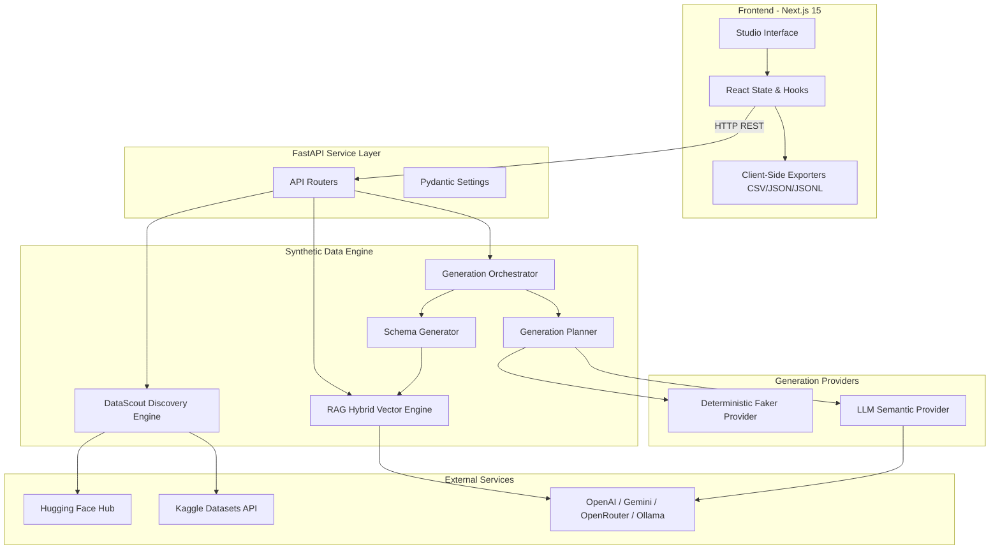
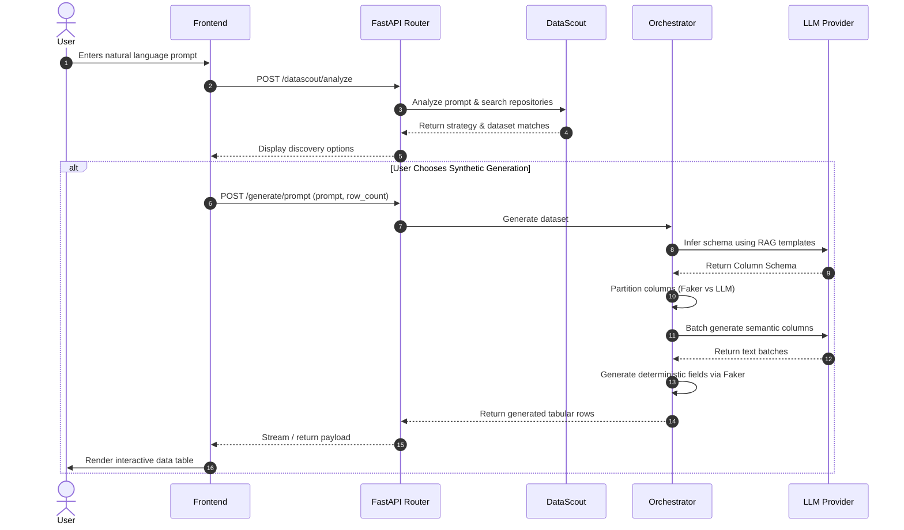

# 🏛 System Architecture Specification

This document details the architectural design, component interactions, and data lifecycle of **Synthetic Data Studio**.

---

## 1. High-Level Architecture Overview

Synthetic Data Studio consists of an interactive Next.js frontend and an extensible FastAPI backend delivering four primary capabilities:

1. **Intelligent Dataset Discovery (DataScout)**: Searches Hugging Face and Kaggle repositories before synthesising from scratch.
2. **Schema Inference & RAG Grounding**: Converts user requirements into formal domain schemas guided by indexed reference templates.
3. **Hybrid Generation Engine**: Blends deterministic, high-throughput Faker algorithms for standard data types with LLM synthesis for complex semantic columns.
4. **Data Profiling & Gap Augmentation**: Detects gaps, missing values, or incomplete schemas and synthesizes missing attributes.

---

## 2. Component Breakdown

### 2.1 DataScout Engine (`app.datascout`)

The DataScout engine minimizes unnecessary compute by discovering verified public datasets that already meet the user's criteria:

- **Keyword Extraction**: Cleanses stopwords and extracts key entity tokens from prompts.
- **Search Execution**: Queries Hugging Face Hub API and Kaggle Datasets API concurrently.
- **Quality & Similarity Scoring**: Computes composite relevance scores based on downloads, upvotes, and textual similarity.
- **Heuristic Matching**: Fast-path cache for foundational benchmark datasets (e.g., Titanic, Credit Card Fraud, MNIST).

### 2.2 RAG Knowledge Engine (`app.rag`)

Ensures generated datasets adhere to industry standard naming conventions, data types, and realistic relationships:

- **Knowledge Base**: Curated catalog of production-grade schemas spanning Finance, Healthcare, E-Commerce, SaaS, and Telemetry.
- **Hybrid Retrieval**: Combines BM25 lexical token matching with dense cosine similarity calculated against cached vector embeddings.
- **Prompt Injection**: Injects top-matching domain schemas into the LLM system prompt as few-shot guides.

### 2.3 Generation Orchestrator (`app.generation`)

The generation orchestrator follows a multi-phase lifecycle:

1. **Schema Generation**: Infers column names, data types, constraints, and dependencies from prompt and RAG context.
2. **Strategy Planning**: Assigns optimal strategy per column:
   - *Deterministic*: Handled by Faker (e.g., Email, Name, Address, Phone, Date, UUID, Integer, Float).
   - *Semantic*: Handled by LLM with batched completion calls (e.g., product reviews, customer feedback, diagnostic notes).
3. **Execution & Assembly**: Generates columns respecting row dependencies (e.g., `first_name` + `last_name` driving `email`).
4. **Validation**: Verifies bounds, constraints, and non-null guarantees prior to serialization.

---

## 3. Data Flow

